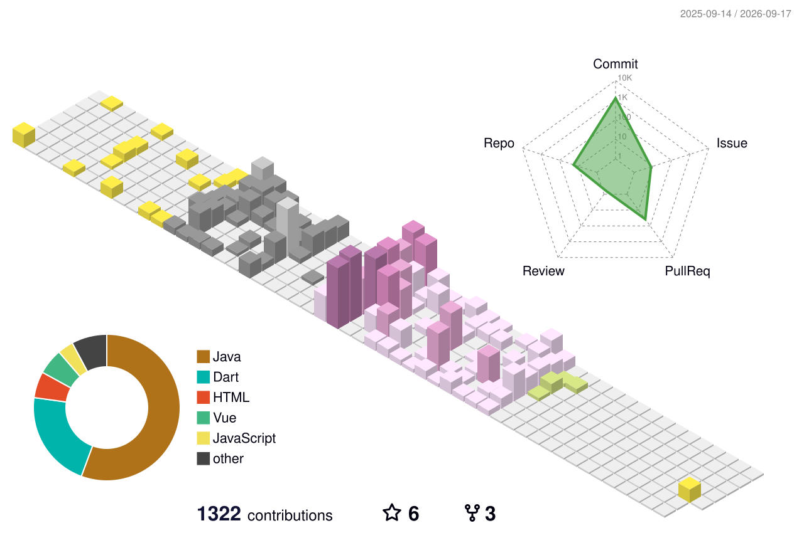

  

 

## About

**Software Engineering student passionate about QA and backend development — building reliable systems and the automated tests that validate them.**

5th-year Computer Engineering student at **ENSA Tétouan**, interested in **QA engineering**, **test automation**, and **backend development**. Oracle-certified in Java, Cloud DevOps and Multicloud Architecture, with hands-on experience building backend services and automated test suites — from API design to CI-ready test reporting.

Currently looking for a **PFE internship in QA or Backend Development**, starting **February 2027**.

## Tech Stack

**Languages**
 

**Testing & QA**
 

**Frameworks**
 

**Frontend**
 

**Databases**
 

**Cloud & DevOps**
 

**Tools**
 

## Experience

<table width="100%">
<tr>
<td width="16%" valign="top"><b>Jul – Aug 2026</b> PortNet</td>
<td valign="top">

**QA & Test Automation Intern** — National Single Window of Foreign Trade

Designed and maintained two automated testing frameworks for the CCM and CITES modules, both structured with the Page Object Model for maintainability and reuse.

Reporting and traceability via Allure, Log4j2 and Apache POI.

</td>
</tr>
<tr><td colspan="2"> </td></tr>
<tr>
<td valign="top"><b>Jul – Aug 2025</b> Naja7Host</td>
<td valign="top">

**Full-Stack Development Intern**

Built **QA-ScenarioHub**, a full test-lifecycle management platform — projects, scenarios, campaigns, executions and bug tracking — with a Gemini-powered assistant for automated test scenario generation.

</td>
</tr>
</table>

## Certifications

## GitHub Activity

 

  

  

<!-- 3D-CONTRIB-START -->
<picture>
  <source media="(prefers-color-scheme: dark)" srcset="profile-3d-contrib/profile-night-rainbow.svg">
  <source media="(prefers-color-scheme: light)" srcset="profile-3d-contrib/profile-season-animate.svg">
  
</picture>
<!-- 3D-CONTRIB-END -->

  

<!-- SNAKE-START -->
<picture>
  <source media="(prefers-color-scheme: dark)" srcset="https://raw.githubusercontent.com/ferdaoussBouchennou/ferdaoussBouchennou/output/github-contribution-grid-snake-dark.svg">
  <source media="(prefers-color-scheme: light)" srcset="https://raw.githubusercontent.com/ferdaoussBouchennou/ferdaoussBouchennou/output/github-contribution-grid-snake.svg">
  
</picture>
<!-- SNAKE-END -->

Built and maintained by Ferdaouss Bouchennou

